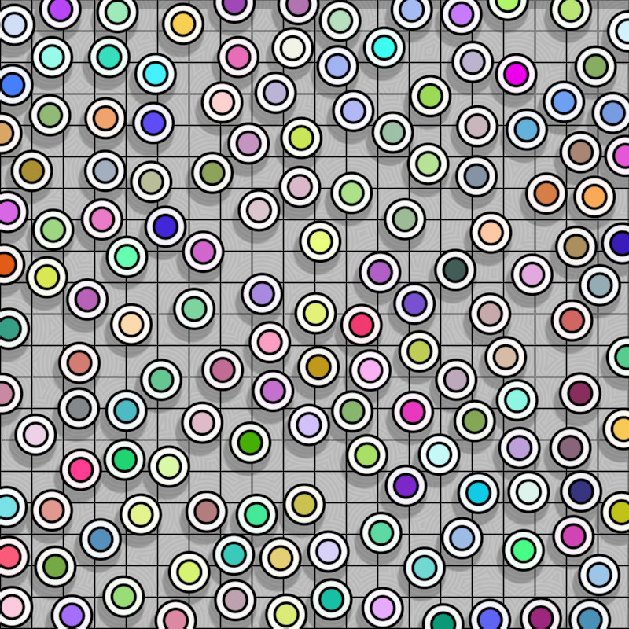

# The challenge

Challenge 1 (easy): modify the code so that it works for any resolution `(width, height)`, e.g. `640 x 480`.

Challenge 2 (medium): implement Bridson's Poisson disk sampling algorithm with other Python packages, use the same config with this repo (400x400 grid and 100K desired points) and whatever acceleration tricks. See if you can beat the speed of Taichi.

Challenge 3 (hard): improve the code so that the result is a maximal Poisson disksampling, that is, there won't be any room left to insert new points.

Please submit your work in this [issue](https://github.com/taichi-dev/poisson-sampling-homework/issues/1).

# Install taichi

```
pip3 install -r requirements.txt  
```

# An interative animation

Mouse and keyboard control:

1. Click mouse to choose an initial point.
2. Press `p` to save screenshots.

Exmaple:

<p align="center">
  
</p>
